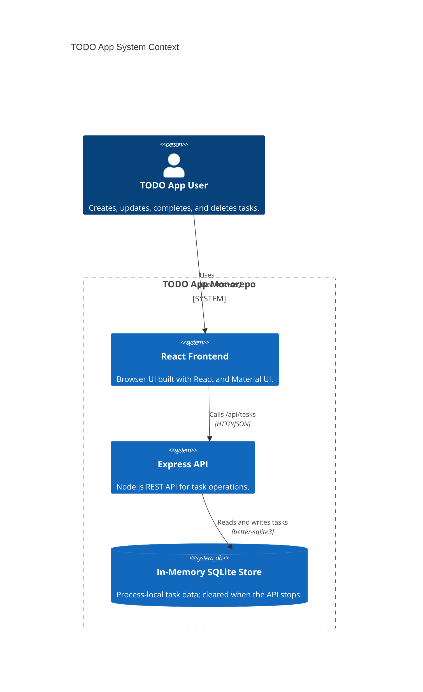
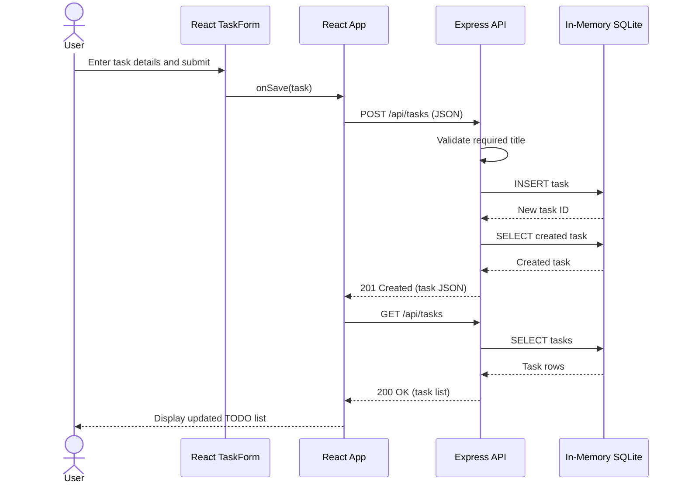

# Cloud Architecture Overview

This monorepo runs as a client-server TODO application. The React frontend serves the user
interface and sends task requests to the Express API. The API reads and writes tasks in an
in-memory SQLite database, so stored data is lost whenever the backend process stops.

## Create a TODO Sequence

## Runtime Notes

- The frontend development server proxies `/api` requests to the backend at
  `http://localhost:3030`.
- The root workspace starts the frontend and backend together with `npm start`.
- The store is not a managed cloud database and provides no persistence across backend
  restarts.
